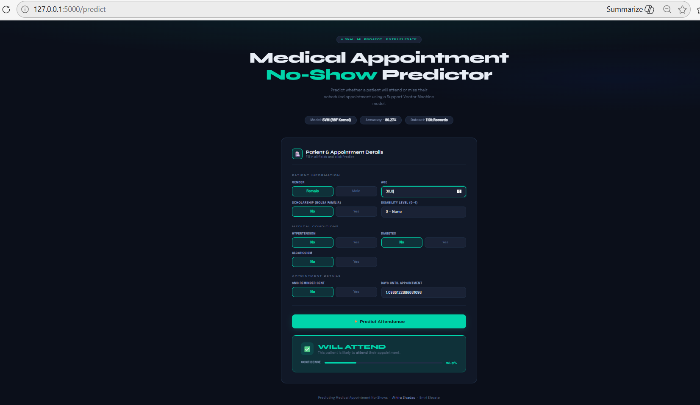

<<<<<<< HEAD
# Predicting Medical Appointment No-Shows Using Machine Learning Techniques

## Overview

Missed medical appointments (no-shows) create challenges for healthcare
providers. They lead to wasted medical resources, longer waiting times
for patients, and reduced hospital efficiency.

This project uses Machine Learning techniques to predict whether a
patient will attend or miss a scheduled medical appointment based on
demographic and medical-related factors.

The goal is to help healthcare providers identify high-risk patients and
take preventive actions such as sending reminders or adjusting
scheduling strategies.

------------------------------------------------------------------------

## Objective

The main objective of this project is to build a machine learning model
that predicts patient appointment attendance using patient information
such as age, gender, health conditions, and appointment waiting time.

------------------------------------------------------------------------

## Dataset

Source: Kaggle\
Dataset Link:
https://www.kaggle.com/datasets/joniarroba/noshowappointments

Dataset Information: - Number of Records: 110,527 - Number of Features:
14

Important Features: - Gender -- Patient gender - Age -- Patient age -
Scholarship -- Whether the patient is enrolled in a welfare program -
Hipertension -- Whether the patient has hypertension - Diabetes --
Whether the patient has diabetes - Alcoholism -- Whether the patient has
alcoholism - Handcap -- Whether the patient has a disability -
SMS_received -- Whether the patient received an SMS reminder -
WaitingDays -- Number of days between scheduling and appointment

Target Variable: No-show - 1 → Patient missed the appointment - 0 →
Patient attended the appointment

------------------------------------------------------------------------

## Data Preprocessing

The following preprocessing steps were applied:

-   Removed unnecessary columns such as PatientId and AppointmentID
-   Handled invalid values such as negative ages
-   Converted categorical variables into numerical form
-   Applied log transformation to reduce skewness in waiting days
-   Scaled numerical features using StandardScaler

------------------------------------------------------------------------

## Exploratory Data Analysis (EDA)

Various visualizations were used to understand the dataset:

-   Histograms
-   Box plots
-   Pair plots
-   Correlation heatmap
-   Count plots
-   Bar charts
-   KDE plots

EDA helped identify patterns such as: - Higher no-show rates among
younger patients - Waiting days affecting appointment attendance -
Impact of SMS reminders on attendance

------------------------------------------------------------------------

## Machine Learning Models Used

The following classification algorithms were implemented:

-   Logistic Regression
-   Decision Tree
-   Random Forest
-   Support Vector Machine (SVM)
-   K-Nearest Neighbors (KNN)

------------------------------------------------------------------------

## Model Performance

  Model                    Accuracy
  ------------------------ ----------
  Logistic Regression      0.8019
  Decision Tree            0.7697
  Random Forest            0.7702
  Support Vector Machine   0.8026
  KNN                      0.7696

The Support Vector Machine (SVM) model achieved the best performance.

------------------------------------------------------------------------

## Web Application

A Flask web application was developed to allow users to input patient
details and predict whether the patient is likely to attend or miss the
appointment.

Technologies used: - Flask - HTML - Python - Scikit-learn

------------------------------------------------------------------------

## How to Run the Project

1.  Install Required Libraries

pip install pandas numpy scikit-learn flask matplotlib seaborn

2.  Run the Flask Application

python app.py

3.  Open in Browser

http://127.0.0.1:5000

------------------------------------------------------------------------

## Technologies Used

-   Python
-   Pandas
-   NumPy
-   Scikit-learn
-   Matplotlib
-   Seaborn
-   Flask
-   HTML/CSS

------------------------------------------------------------------------

## Conclusion

This project demonstrates how machine learning can help healthcare
systems predict appointment no-shows and improve hospital scheduling
efficiency.

The developed model achieved around 80% prediction accuracy and can
assist healthcare providers in identifying patients who are likely to
miss their appointments.

------------------------------------------------------------------------

## References

1.  Kaggle Dataset\
    https://www.kaggle.com/datasets/joniarroba/noshowappointments

=======
# MachineLearningMiniProject-
MachineLearningMiniProject 
